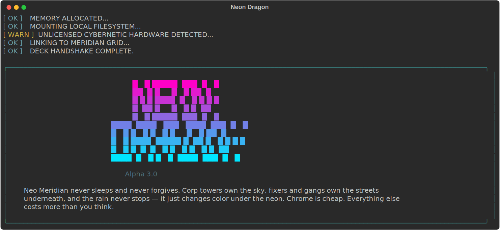

# Neon Dragon

**Alpha 3.0**

A single-player, terminal-based RPG set in a cyberpunk vaporwave city —
Neo Meridian. No server, no accounts, no web frontend. Just a Python
CLI you run in a terminal, with a local JSON save file per character.



## Requirements

- Python 3.11+
- [Rich](https://github.com/Textualize/rich) (terminal UI/formatting)

## Setup

```bash
git clone <repo-url> neon-dragon
cd neon-dragon
python3 -m venv .venv
.venv/bin/pip install -r requirements.txt
```

## Run

```bash
.venv/bin/python main.py
```

## Features

### Core loop

- **2 classes** — Street Samurai, Netrunner, each a different balance
  of the same stats (a third, charisma-focused class is pulled for now
  pending a redesign)
- **8 hub locations**, each with real mechanics: Undercity (Jack In /
  Find a Fight / Scavenge), NetVault (banking), Hyphen8d's Hut
  (cyberware with a daily rotating stock and market events), Doc
  Wire's Clinic (healing, curing, consumable supplies), RoboDOJO (real
  sparring fights to train stats, plus purchasable combat abilities),
  The Pit (tiered gladiator fights), Fixer Board (reputation-gated
  contracts), Chrome Noodle Bar (free rest + charisma-gated contracts)
- **A day/night cycle** — leaving the hub (with confirmation) sends
  your merc home to sleep: full heal, status effects cleared, daily
  caps reset (RoboDOJO sparring, Buy a Round, Chrome Noodle Bar's free
  rest), and a "Daily Data Feed" panel summarizing where you stand,
  led by a **City Conditions** weather line and fake news headline that
  stick for the whole day — mostly worldbuilding, but some conditions
  actually move the needle: a Tech Interference weather makes Tech/Hack
  actions riskier-but-harder-hitting in combat, and certain headlines
  force Hyphen8d's Hut into a price surge or discount
- **JSON save/load** — one file per character, autosaved whenever you
  leave the hub *and* on a crash or interrupt mid-session

### Combat

- **A live two-panel HUD** — HP bars, status badges, a real-time enemy
  sensor scan, directional »»»/««« narration tags, and gear- and
  damage-aware hit descriptions that change with your equipped
  cyberware, class, and how hard you actually hit
- **Status effects** (Bleeding, Stunned, Drunk) with colored ASCII
  hazard badges, and per-enemy factions (Street Gang, Corp, Scavs,
  Ronin, Feral, Gladiator)
- **Class specials and abilities** — a signature class special on a
  cooldown (Street Samurai's Samurai Slash, Netrunner's Override
  System) plus two more class-independent combat abilities
  purchasable at RoboDOJO (Adrenal Surge, Kill Switch), each stacking
  on top of a class special with its own cooldown
- **Intimidate** — once you've badly outleveled a random Undercity
  enemy, a guaranteed, no-risk option to scare it off for its credits
  instead of grinding through another trash-mob fight; skipped reward
  is XP and reputation, not the fight itself, and it never shows up
  against Pit gladiators or other fights you can pace yourself

### A living city

- **NPCs react to who you are** — kill-count and reputation thresholds
  unlock new dialogue pools (a local-hero welcome at 15+ Corp kills, a
  hidden gear stash at 15+ Street Gang kills), and several NPCs
  comment directly on specific cyberware you've got equipped when you
  walk in
- **A living arena** — beat the Pit's toughest gladiator and The Pit
  itself acknowledges you as reigning champion, while he starts
  occasionally ambushing you out in the Undercity to reclaim his honor
- **Buy a Round micro-encounters** at the Chrome Noodle Bar — not a
  flat dice roll, but 9 flavored mini-narratives (pickpocket Scavs,
  rambling netrunners, synth-arm-wrestling gangers, smooth-talking
  fixers) each precede their own stat/reputation/status payoff
- **Faction Heat** — rack up too many kills against Corp or Street
  Gang in one day and you risk a retaliatory ambush, mid-Scavenge or
  the moment you wake up

### Economy and progression

- **A dynamic economy at Hyphen8d's Hut** — a random daily price event
  (discount or surge) on one cyberware slot, on top of a Charisma
  discount that stacks with it
- **A consumable-item inventory** (Nanite Patches, EMP Grenades, and
  more) usable mid-combat without breaking your turn economy, never
  consumed on a no-op use (full-HP heal, faction-mismatched stun)
- **Charisma has real mechanical weight** — shop discounts, cheaper
  trauma bills after a lost fight, gates on higher-tier contracts, and
  it shapes actual dialogue and outcomes: several NPCs unlock warmer,
  secret-revealing lines at high Charisma, and some contracts let you
  talk your way past a target instead of fighting them (the **coerce**
  step — fail the check and you're in a fight instead). Grows like any
  other stat too, via a level-up bonus point or Buy a Round, instead of
  being capped by whichever skin-slot cyberware you happen to own
- **A rare, eerie secondary currency** (Quantum Cores — "grown, not
  manufactured") and two black-market economies built around it and
  around Street Gang kills, for players who go looking
- **Content depth** — 11 Undercity encounters (including a kill-gated
  nemesis fight), 5 Pit gladiators, and 20 contracts across two
  boards, enough variety that repeat play doesn't loop the same
  handful of fights
- **Achievements & Milestones** — data-driven unlocks (`content/achievements.json`)
  for combat, cyberware, and stat milestones, announced with a styled
  panel the moment they're earned. Includes **RoboDOJO belt ranks**:
  gaining 6 Attack or Defense over your class's starting value unlocks
  a Black Belt achievement that grants a small permanent combat bonus
  on top of the stat itself — measured as a gain, not a flat number,
  so it takes the same real investment for every class
- **Datashards** — corrupted lore fragments (`content/datashards.json`)
  hinting at a rogue AI on the grid, purged corporate archives, and the
  unsettling truth behind Quantum Cores. A rare find on a clean Slice
  Drop Box crack or a successful Hunt Cache sweep, readable anytime from
  the hub's Archives screen, rendered as a glitched-out terminal dump

### Quality of life

- **In-game character info (`[I]`), lore archives (`[A]`), and help
  (`[?]`) screens**, accessible mid-session without spending a turn
- **Bracket-hotkey menus throughout** — every screen shows a
  bold-bracketed letter, and on a real terminal you don't even need to
  press Enter
- **A fixed 120-column layout** so tables and panels render
  identically regardless of terminal width

## Docs

- [`GAME_DESIGN.md`](GAME_DESIGN.md) — world, hub locations, and
  mechanics design notes; the source of truth for what the game
  currently is and how it's meant to evolve
- [`PLAYER_GUIDE.md`](PLAYER_GUIDE.md) — how everything actually works
  right now, including an honest list of what's not built yet. Also
  readable in-game via the `?` command
- [`ADMIN_GUIDE.md`](ADMIN_GUIDE.md) — admin-facing reference wiki:
  every location, NPC, enemy, gladiator, contract, and item with its
  actual numbers, pulled straight from `content/*.json` and the
  engine constants. Use this to look something up; use `GAME_DESIGN.md`
  to understand why it works that way
- [`CLAUDE.md`](CLAUDE.md) — the technical/process contract this
  project is built under (this was built with
  [Claude Code](https://claude.com/claude-code))

## Content is data, not code

NPCs, contracts, encounter tables, cyberware, consumables, and the
Pit's gladiator roster all live under [`content/`](content/) as JSON.
Adding or tuning content is a data edit, not a code change. (Class
templates, combat specials/abilities, and RoboDOJO's sparring drones
are the deliberate exceptions — see `ADMIN_GUIDE.md`'s content map.)

## Status

Alpha 3.0. Every hub location has real mechanics; RoboDOJO trains
stats through actual sparring fights and sells permanent combat
abilities; the current "end game" is working through Fixer Board and
Chrome Noodle Bar contracts (20 across both boards), with a
day-cycle economy layered on top of it. See the "What's not built
yet" section of `PLAYER_GUIDE.md` for known gaps.

## Credits

Built by Matthew Arevalo ([Gial Ventures](mailto:matt@gial.co)) with
[Claude](https://claude.com) via [Claude Code](https://claude.com/claude-code).

## License

[MIT](LICENSE) — free to use, modify, and distribute. Keep the
copyright notice.
